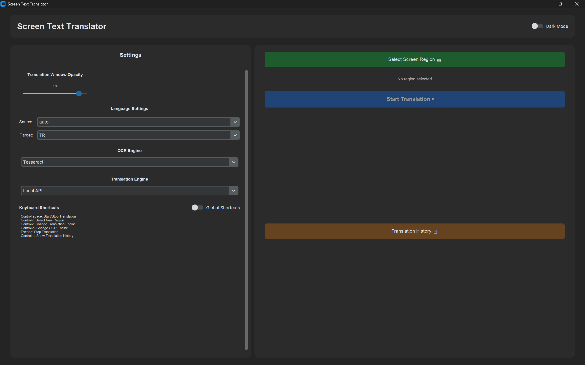
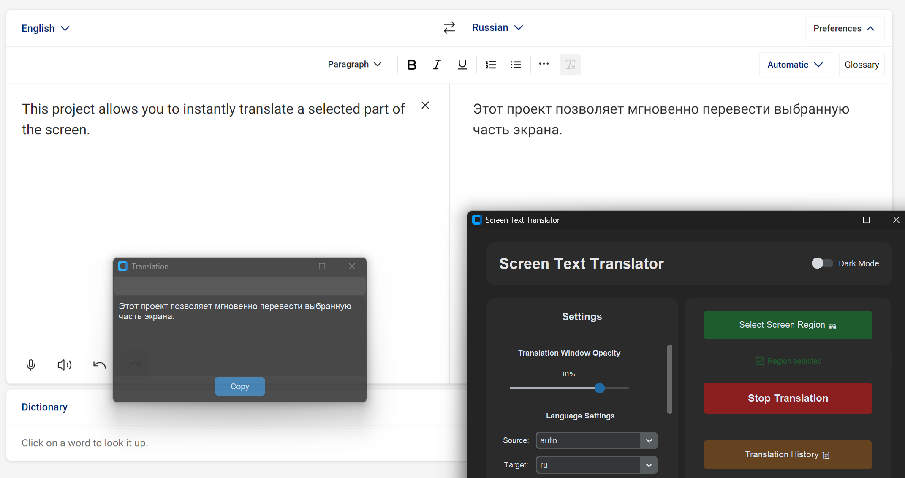
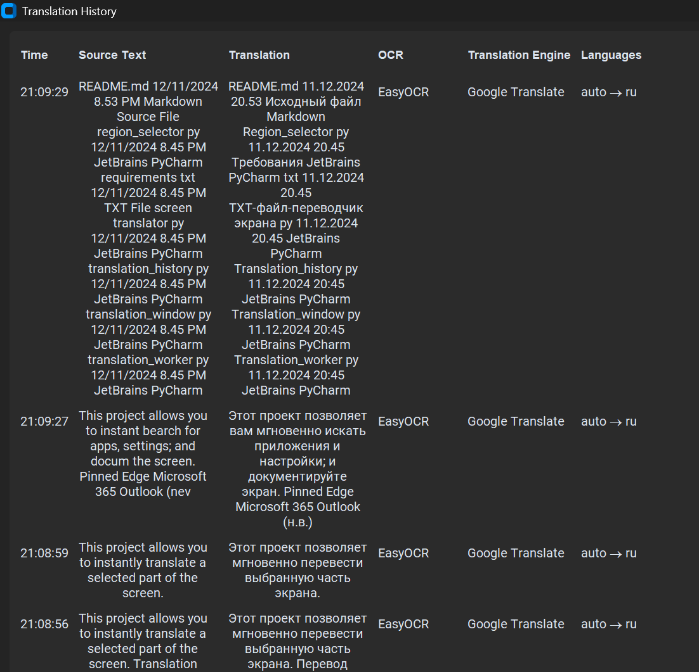

# Live-Screen-Translator
Real-time screen text translator with OCR. Capture and translate text from any area of your screen instantly.

## 📸 Screenshots

### Main Application Window


### Translation in Action


### Translation History


## 🌟 Features

- **Multiple OCR Engines**
  - Tesseract OCR
  - EasyOCR
  - Windows OCR

- **Multiple Translation Engines**
  - Local API( Deeplx)
  - Google Translate
  - Gemini AI

- **User-Friendly Interface**
  - Customizable screen region selection
  - Adjustable translation window opacity
  - Dark/Light theme support
  - Translation history
  - Draggable translation window

- **Keyboard Shortcuts**
  - Support for both global and local shortcuts
  - Fully customizable shortcut bindings

## 🔧 Requirements

- Python 3.8 or higher
- Deeplx for local translation
- Tesseract OCR installed on your system
- Windows 10/11 (for Windows OCR support)
- NVIDIA GPU (optional, for faster EasyOCR processing)

## 📦 Installation

1. **Clone the repository**   ```bash
   git clone https://github.com/yourusername/screen-text-translator.git
   cd screen-text-translator   ```

2. **Create and activate virtual environment (recommended)**   ```bash
   python -m venv venv
   # Windows
   .\venv\Scripts\activate
   # Linux/MacOS
   source venv/bin/activate   ```

3. **Install required packages**   ```bash
   pip install -r requirements.txt   ```

4. **Install Tesseract OCR**
   - **Windows**: Download installer from (https://github.com/tesseract-ocr/tesseract)
   - **Linux**: `sudo apt-get install tesseract-ocr`
   - **MacOS**: `brew install tesseract`

5. **Configure environment variables**
   - Copy `.env.example` to `.env`
   - Add your Tesseract installation path and API keys

## 🚀 Usage

1. **Start the application**   ```bash
   python screen_translator.py   ```

2. **Select screen region**
   - Click "Select Screen Region" button or press `Ctrl+R`
   - Click and drag to select the desired area

3. **Start translation**
   - Click "Start Translation" button or press `Ctrl+Space`
   - The translation will appear in a floating window

### ⌨️ Keyboard Shortcuts

| Shortcut | Action |
|----------|--------|
| `Ctrl+Space` | Start/Stop Translation |
| `Ctrl+R` | Select New Region |
| `Ctrl+T` | Change Translation Engine |
| `Ctrl+O` | Change OCR Engine |
| `Ctrl+H` | Show Translation History |
| `Esc` | Stop Translation |

## ⚙️ Configuration

The application settings can be configured through the UI or by editing `config.json`:

- Theme mode (dark/light)
- Translation window opacity
- Default languages
- Preferred OCR and translation engines
- Global shortcuts enable/disable

## 🔍 Troubleshooting

### Common Issues

1. **Tesseract not found**
   - Ensure Tesseract is installed
   - Set correct path in `.env` file
   - Verify installation by running `tesseract --version`

2. **EasyOCR installation fails**
   - Update pip: `pip install --upgrade pip`
   - Install Visual C++ Build Tools (Windows)
   - Try installing torch separately first

3. **Windows OCR not working**
   - Ensure you're running Windows 10/11
   - Install Windows OCR language packs

## 🤝 Contributing

Contributions are welcome! Please feel free to submit a Pull Request.

1. Fork the repository
2. Create your feature branch (`git checkout -b feature/AmazingFeature`)
3. Commit your changes (`git commit -m 'Add some AmazingFeature'`)
4. Push to the branch (`git push origin feature/AmazingFeature`)
5. Open a Pull Request

## 📝 License

This project is licensed under the MIT License - see the [LICENSE](LICENSE) file for details.

## 🙏 Acknowledgments

- [Tesseract OCR](https://github.com/tesseract-ocr/tesseract)
- [EasyOCR](https://github.com/JaidedAI/EasyOCR)
- [CustomTkinter](https://github.com/TomSchimansky/CustomTkinter)
- [Deeplx](https://github.com/OwO-Network/DeepLX)

